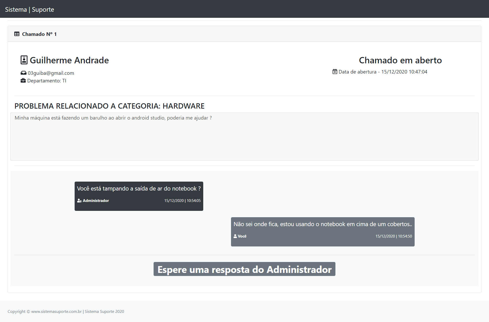

# Sistema Suporte

A idéia deste projeto foi criar um sistema para receber chamados de colaboradores e ter um controle de ocorrências e inventário de ativos de infra.
> O FrontEnd foi feito utilizando bootstrap 4 e php no BackEnd.
 

Nesta tela o usuário abre um chamado, é importante que utilize um e-mail válido pois o link para tratar o chamado será enviado por lá.

> Rota: "/abrir-chamado"
 

Ao abrir um chamado, receber uma mensagem no chamado, ter o chamado fechado ou reaberto, o usuário irá receber um e-mail informando.

 

Tela de login para o administrador.

> Rota: "/login"
 

Ao acessar o sistema, a tela inicial permite que cada usuário crie anotações para se lembrar de tarefas futuras ou algo do tipo.

> Rota: "/admin"
 

Na tela de inventário é possível registrar ativos de TI.

> Rota: "/admin/inventario"
 

Todos os chamados ficam aqui, é possível reabrir ou fecha-los.

> Rota: "/admin/chamados"
 

Nesta tela o chamado é tratado com o usuário em um chat. O administrador pode mandar quantas mensagens quiser.

> Rota: "/admin/chamados/abrir" + token único
 

Esta é a tela do chamado do usuário, o link de acesso dela é enviado no seu e-mail. O usuário pode mandar uma mensagem de até 1500 caracteres por vez.

> Rota: "/chamado" + token único
 

Processo para fechar chamados.

 

Mesmo com o chamado concluido, o usuário ainda pode acessar o link para ver o histórico de mensagens.

 

Apenas administradores possuem acesso á esta tela, aqui é possível criar novos usuários para auxiliarem com os chamados.

> Rota: "/admin/usuarios"
